<div align="center">

# 🎯 One2Ten

### Ticket in. Verified work out.

**An end-to-end ticket workflow skill for Claude Code** — runs any task
ticket from intake to an evidence-backed completion report, across n8n,
Make, Supabase, and code.

[](https://claude.com/claude-code)
[](https://n8n.io)
[](https://make.com)
[](https://supabase.com)

`Understand → Plan → Build → Test → Report`
**One approval gate. Zero unverified claims.**

</div>

---

## ✨ Why

AI-engineer tickets rarely live in one place — a bug might span an n8n
workflow, a Supabase table, and a voice agent. One2Ten gives Claude Code a
single disciplined process for all of it:

- 🔍 **Evidence before fixes** — bugs get root-cause proof from real
  executions and logs before any plan is written
- 📋 **Plans with no hand-waving** — every step contains the actual SQL,
  node config, or code; "add error handling" is a banned phrase
- 🤖 **Multi-agent build** — fresh implementer subagent per task, reviewer
  subagent after each, fix loops until clean
- 🧾 **Receipts required** — nothing is reported "done" without the command
  that proves it and its observed output
- 🛡️ **Production-safe** — live assets are fetched before edits, rollback
  copies saved, destructive actions always ask first

## 🔄 The Flow

```mermaid
flowchart LR
    A["🧠 Understand<br/><sub>fetch ticket · classify ·<br/>root-cause bugs first</sub>"] --> B["📋 Plan<br/><sub>explore live state ·<br/>task-by-task plan</sub>"]
    B --> G{{"🚦 Your approval<br/><sub>the only stop</sub>"}}
    G --> C["🔨 Build<br/><sub>implementer + reviewer<br/>subagents per task</sub>"]
    C --> D["🧪 Test<br/><sub>end-to-end vs acceptance<br/>criteria · evidence rule</sub>"]
    D --> E["📬 Report<br/><sub>what changed · proof ·<br/>root cause · follow-ups</sub>"]
```



| Phase | What happens |
|:-----:|--------------|
| 🧠 **Understand** | Fetches the ticket (Zoho Projects MCP) or restates your chat brief; classifies **feature / task / bug**. Bugs get evidence first: failing executions and logs pulled, root cause *demonstrated* — never guessed. |
| 📋 **Plan** | Explores the live state of every affected system, then writes a task-by-task plan to `.one2ten/plans/` with real node configs, SQL, and code in every step. Destructive steps flagged ⚠️. **Stops once for your approval.** |
| 🔨 **Build** | Subagent-driven: fresh implementer per task, reviewer after each (git diff for code · live MCP state for platform work), fix loops, and a progress ledger that survives session crashes. |
| 🧪 **Test** | Verifies the *ticket's* acceptance criteria end-to-end — real workflow runs, real queries, real app flows. Every "it works" carries proof. |
| 📬 **Report** | Chat summary: exact asset names/IDs changed, verification evidence, one-sentence root cause (bugs), follow-ups. |

## 🚀 Install

**Windows (PowerShell)**
```powershell
git clone https://github.com/sys-nat-ai/One2Ten.git one2ten-skill
New-Item -ItemType Directory -Force "$env:USERPROFILE\.claude\skills\one2ten\references"
Copy-Item "one2ten-skill\SKILL.md" "$env:USERPROFILE\.claude\skills\one2ten\"
Copy-Item "one2ten-skill\references\*.md" "$env:USERPROFILE\.claude\skills\one2ten\references\"
```

**macOS / Linux**
```bash
git clone https://github.com/sys-nat-ai/One2Ten.git one2ten-skill
mkdir -p ~/.claude/skills/one2ten
cp one2ten-skill/SKILL.md ~/.claude/skills/one2ten/
cp -r one2ten-skill/references ~/.claude/skills/one2ten/
```

> 💡 Prefer a per-project install? Drop `SKILL.md` + `references/` into
> `<project>/.claude/skills/one2ten/` instead. New Claude Code sessions
> pick it up automatically.

## 🎮 Use

```text
/one2ten <your ticket>
```

```text
/one2ten Fix the lead-sync workflow in n8n — failing since yesterday
/one2ten Zoho task "Add SMS reminders" in the ClientX project
```

…or just paste a ticket / bug report and ask Claude to handle it end to end.

**Tips**

- 📂 Run it from the project folder the ticket belongs to — plans, briefs,
  and the ledger land in that project's `.one2ten/` directory
- 🔁 Session died mid-ticket? Re-invoke it — the `.one2ten/progress.md`
  ledger prevents redoing completed tasks
- ⏸️ After plan approval it only interrupts for: destructive actions,
  missing credentials, genuine ambiguity, or an unresolvable blocker

## 🗂️ Repo layout

```text
SKILL.md                  # 🎯 the orchestrator: phases, gate, rules
references/
  planning.md             # 📋 plan format — no-placeholder rules
  subagents.md            # 🤖 dispatch contracts, review modes, ledger
  n8n.md                  # 🔧 n8n MCP playbook
  make.md                 # 🔧 Make MCP playbook
  supabase.md             # 🔧 Supabase MCP playbook
  code.md                 # 🔧 code / apps / Vapi playbook
docs/superpowers/         # 📜 design spec + implementation plan (history)
```

## 📦 Requirements

- **Claude Code** with subagent support (the `Agent` tool) for the Build phase
- The **MCPs your tickets touch** connected — n8n, Make, Supabase, Zoho
  Projects, Vapi (only the ones you actually use)

## 🙏 Credits

Workflow patterns adapted from the
[Superpowers](https://github.com/obra/superpowers) skill family —
*writing-plans*, *subagent-driven-development*, *systematic-debugging*,
*verification-before-completion* — tailored for MCP-based automation work
where changes live outside git.

<div align="center">

---

Made with ☕ by **Nat**

</div>
